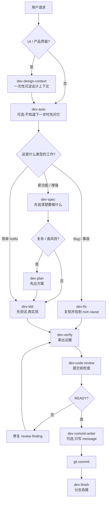

<div align="center">
  
  <p>
    10 个 skill,把 AI 写代码和做界面这件事拆成更稳的步骤。<br/>
    <b>沉淀设计上下文 → 想清楚需求 → 定方案 → 写代码 / 修 bug → 验证 → review → commit → 收尾</b>
  </p>
</div>

<p align="center">
  
  
  
  
</p>

<p align="center">
  <a href="https://jason-chen-coder.github.io/dev-skills/">Website</a>
  ·
  <a href="./docs/onboarding.md">Onboarding</a>
  ·
  <a href="./skills/dev-auto/">Start with dev-auto</a>
</p>

---

## 这是什么

dev-skills 是一套给 Claude Code / Codex 用的 SDD-style 开发工作流规则集。它让 AI 做开发时先对齐意图、范围、方案和验证证据,而不是每次从零猜流程。

它主要解决四类问题:

- 需求还没说清楚,AI 就开始写代码。
- 写完只说“已完成”,但没有测试和证据。
- 修 bug 只改了表面现象,没有找到 root cause。
- commit 前没人检查,容易把无关改动、坏测试、临时代码一起提交。

第一次用只记住一句话:

> 不知道下一步做什么,就先用 `dev-auto`。它只会推荐下一步,不会替你自动执行其他 skill。

---

## 快速开始

- 不知道下一步:说 `用 dev-auto 看看下一步该做什么`。
- 新功能 / 改功能:先说 `用 dev-spec 帮我梳理这个需求`。
- UI / landing page / 产品界面:先说 `用 dev-design-context 沉淀设计上下文`。
- 修 bug / 排查问题:先说 `用 dev-fix 排查这个 bug`。
- 准备 commit:先说 `用 dev-code-review 看下这次修改`。

---

## 三条常用路径

### 新功能 / 改功能

```text
dev-design-context(可选) -> dev-spec -> dev-plan(可选) -> dev-tdd -> dev-verify -> dev-code-review -> git commit -> dev-finish
```

先把需求说清楚。复杂功能再出方案。写代码前用测试锁住行为,完成前验证,提交前 review。

### Bug / 事故

```text
dev-fix -> dev-verify -> dev-code-review -> git commit -> dev-finish
```

先复现,再找 root cause。`dev-fix` 已经包含 regression test,不要再额外接一轮 `dev-tdd`。

### 小 hotfix

```text
dev-tdd -> dev-verify -> dev-code-review -> git commit
```

可以跳过 spec 和 plan。只要会改行为,仍然建议先用测试锁住这次小改动。

---

## SDD 怎么接进来

这里的 SDD 指 Spec-Driven Development。`dev-skills` 不把它做成重型状态机,而是把现有 skill 串成一条可追踪的契约链:

```text
Intent / Context
  -> Spec: dev-spec
  -> Plan / ADR: dev-plan
  -> Tests / Fix evidence: dev-tdd 或 dev-fix
  -> Verify: dev-verify
  -> Review: dev-code-review
  -> Ship: git commit / dev-finish
```

简单任务可以只做到 Spec-first;复杂、高风险或多 agent 任务建议做到 Spec-anchored,把 `.claude/artifacts/` 里的 spec / plan / fix 作为后续实现、验证、review 的对齐依据。

完整说明见 [`docs/sdd-workflow.md`](./docs/sdd-workflow.md)。

---

## Skill 怎么选

按你当前的问题选一组就够了,不用把 10 个 skill 全背下来。

### 不知道下一步

- [`dev-auto`](./skills/dev-auto/):看当前状态,推荐下一条命令。它不会自动调起其他 skill。

### 需求和方案

- [`dev-design-context`](./skills/dev-design-context/):做 UI 前,先沉淀项目设计上下文。
- [`dev-spec`](./skills/dev-spec/):把模糊需求整理成 scope、风险和验收标准。
- [`dev-plan`](./skills/dev-plan/):复杂或高风险功能先出实施方案。

### 实现和修复

- [`dev-tdd`](./skills/dev-tdd/):新功能或 scoped 改动写代码前,先用测试锁住行为。
- [`dev-fix`](./skills/dev-fix/):修 bug 时先复现,再定位 root cause。

### 完成和提交

- [`dev-verify`](./skills/dev-verify/):声称完成、fixed、ready 前,补齐真实命令证据。
- [`dev-code-review`](./skills/dev-code-review/):准备 commit 前,检查 diff 风险。
- [`dev-commit-writer`](./skills/dev-commit-writer/):明确跳过 review 且只要 commit message 时使用。
- [`dev-finish`](./skills/dev-finish/):验证和 review 通过后,处理分支收尾。

---

## 安装

Claude Code、Codex、npx skills 的安装方式不一样。选你正在用的工具即可。

### Claude Code

```bash
/plugin marketplace add https://github.com/Jason-chen-coder/dev-skills
/plugin install dev-skills
```

如果还想让团队规则一直生效,把模板复制到项目根目录:

```bash
curl -O https://raw.githubusercontent.com/Jason-chen-coder/dev-skills/master/CLAUDE.md.template
mv CLAUDE.md.template CLAUDE.md
```

### Codex

正式上架前,本地兼容方式是把 `skills/*` 复制到 Codex 的 skills 目录:

```bash
git clone https://github.com/Jason-chen-coder/dev-skills.git
cd dev-skills
bash scripts/install-codex-skills.sh
```

如果还想让团队规则一直生效,把 Codex 模板复制到项目根目录:

```bash
curl -O https://raw.githubusercontent.com/Jason-chen-coder/dev-skills/master/AGENTS.md.template
mv AGENTS.md.template AGENTS.md
```

### npx skills

```bash
npx skills add Jason-chen-coder/dev-skills              # 安装到当前项目
npx skills add Jason-chen-coder/dev-skills --global     # 安装到全局
```

更完整的安装、兜底方案和升级说明见 [`docs/onboarding.md`](./docs/onboarding.md)。

---

## 升级

<details>
<summary><b>展开升级命令</b></summary>

### Claude Code

```bash
/plugin update dev-skills
```

如果没生效,卸载后重装:

```bash
/plugin uninstall dev-skills
/plugin install dev-skills
```

### Codex

Codex 当前是复制目录安装,所以升级时需要重新同步:

```bash
cd dev-skills
bash scripts/install-codex-skills.sh --upgrade
```

### npx skills

```bash
npx skills update
```

如果你的版本没有 update,用 force 重新安装:

```bash
npx skills add Jason-chen-coder/dev-skills --force
npx skills add Jason-chen-coder/dev-skills --global --force
```

提醒:升级 skill 不会自动覆盖你项目里的 `CLAUDE.md` / `AGENTS.md`。如果模板更新了,需要你自己对比后同步。

</details>

---

## 怎么在对话里用

```text
用 dev-auto 看看下一步该做什么
用 dev-spec 帮我梳理这个需求: ...
用 dev-plan 基于这个 spec 出实施方案
用 dev-fix 排查这个 bug: ...
用 dev-code-review 看下这次修改,准备 commit
我自审过了,只要 dev-commit-writer 给 commit message
```

`dev-tdd`、`dev-verify`、`dev-finish` 一般不用主动点名。它们是流程门禁,agent 会在写代码前、声称完成前、分支收尾时提醒。

---

## Multi-agent 怎么用

如果你的 runtime 支持多 agent,`dev-skills` 可以作为分工协议使用。SDD artifact 是 agent 之间的契约,不是聊天记录里的口头约定:

- 主 agent:负责用户沟通、拆分任务、最终整合和 git 操作。
- 子 agent:只做边界清晰的探索、实现、验证或 review,并基于 spec / plan / fix artifact 输出证据。

```toml
[features]
multi_agent = true
parallel = true

[agents]
max_threads = 12
max_depth = 2
```

对话里可以这样说:

```text
这个任务可以用多 agent 并行处理,请按 dev-skills 的 multi-agent policy 拆分。
```

不要让多个 worker 改同一批文件,也不要把 merge、push、discard 交给子 agent。完整规则见 [`docs/multi-agent-policy.md`](./docs/multi-agent-policy.md)。

---

## 规则和文档

- [`references/dev-baseline.md`](./references/dev-baseline.md):所有 skill 都会加载的基础规则。
- [`docs/sdd-workflow.md`](./docs/sdd-workflow.md):说明 dev-skills 如何用轻量 SDD 连接 workflow 和 multi-agent 协作。
- [`docs/why-dev-baseline.md`](./docs/why-dev-baseline.md):解释这些基础规则为什么存在。
- [`CLAUDE.md.template`](./CLAUDE.md.template) / [`AGENTS.md.template`](./AGENTS.md.template):复制到项目根目录后,作为常驻团队规则。
- [`docs/team-policy.md`](./docs/team-policy.md):更细的分支、PR、测试、错误处理和团队治理说明。
- [`docs/multi-agent-policy.md`](./docs/multi-agent-policy.md):多 agent runtime 下的分工、ownership、verifier / reviewer 规则。

---

## 工作流图

<details>
<summary><b>展开完整流程图</b></summary>



</details>

---

## 你可能会问

<details>
<summary><b>这些 skill 会互相自动调用吗?</b></summary>

不会。

`dev-auto` 只推荐下一步,不自动调起其他 skill。其他 skill 也都只做自己的事。这样做是为了让每一步都可控、可复核。

</details>

<details>
<summary><b>哪些 skill 会生成文件?</b></summary>

| Skill | Artifact |
|---|---|
| `dev-design-context` | `.design-context.md` |
| `dev-spec` | `.claude/artifacts/designs/<feature>.md` |
| `dev-plan` | `.claude/artifacts/plans/<feature>.md` |
| `dev-fix` | `.claude/artifacts/fixes/<slug>.md` |
| `dev-auto` / `dev-tdd` / `dev-verify` / `dev-code-review` / `dev-commit-writer` / `dev-finish` | 不生成 artifact,只输出到 chat |

`dev-code-review` 和 `dev-commit-writer` 可以读取这些 artifact,并在 commit message 里自动补 `Refs: <type>/<slug>`。

</details>

<details>
<summary><b>我只是改一行,也要跑完整流程吗?</b></summary>

不用。

一句话 hotfix 可以跳过 `dev-spec` 和 `dev-plan`,但只要改的是行为,仍建议走:

```text
dev-tdd -> dev-verify -> dev-code-review -> git commit
```

</details>

<details>
<summary><b>什么时候用 dev-code-review,什么时候用 dev-commit-writer?</b></summary>

准备 commit 前,默认用 `dev-code-review`。

只有你已经自审过、明确只想要 commit message 时,才用 `dev-commit-writer`。

</details>

---

## 版本历史

详见 [`CHANGELOG.md`](./CHANGELOG.md)。

---

<p align="center">
  <sub>
    MIT License · <a href="./CHANGELOG.md">CHANGELOG</a> · <a href="./CONTRIBUTING.md">Contributing</a> · <a href="https://github.com/Jason-chen-coder/dev-skills/issues">Issues</a>
  </sub>
</p>

<p align="center">
  <sub>灵感来自 <a href="https://github.com/forrestchang/andrej-karpathy-skills">karpathy-skills</a> · <a href="https://github.com/yeachan-heo/oh-my-claudecode">oh-my-claudecode</a></sub>
</p>
