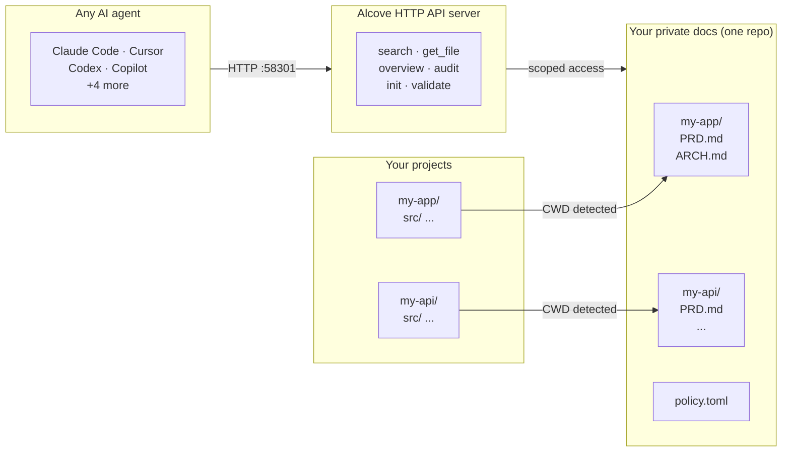

<p align="center">
  
</p>

<p align="center"><strong>Your AI agent doesn't know your project. Alcove fixes that.</strong></p>

<p align="center"><a href="#quick-start">→ Quick start</a></p>

<p align="center">
  <a href="README.md">English</a> ·
  <a href="docs/README.ko.md">한국어</a> ·
  <a href="docs/README.ja.md">日本語</a> ·
  <a href="docs/README.zh-CN.md">简体中文</a> ·
  <a href="docs/README.es.md">Español</a> ·
  <a href="docs/README.hi.md">हिन्दी</a> ·
  <a href="docs/README.pt-BR.md">Português</a> ·
  <a href="docs/README.de.md">Deutsch</a> ·
  <a href="docs/README.fr.md">Français</a> ·
  <a href="docs/README.ru.md">Русский</a>
</p>

<p align="center">
  <a href="https://github.com/epicsagas/alcove/stargazers"></a>
  <a href="https://github.com/epicsagas/alcove/network/members"></a>
  <a href="https://github.com/epicsagas/alcove/issues"></a>
  <a href="https://github.com/epicsagas/alcove/commits/main"></a>
</p>
<p align="center">
  <a href="https://glama.ai/mcp/servers/epicsagas/alcove"></a>
  <a href="https://crates.io/crates/alcove"></a>
  <a href="https://crates.io/crates/alcove"></a>
  <a href="LICENSE"></a>
  <a href="https://buymeacoffee.com/epicsaga"></a>
</p>

Alcove is an HTTP API server that gives AI coding agents on-demand access to your private project docs — **BM25 + vector hybrid search** for precision retrieval, **tree-sitter code indexing** so agents understand your codebase structure, and **policy enforcement** for doc consistency. No context bloat, no leaking docs into public repos, no per-project config for every agent.

## Demo


> *Claude, Codex — search · switch projects · global search · validate & generate. One setup.*

<details>
<summary>CLI demo</summary>


> *`alcove search` · project switch · `--scope global` · `alcove validate`*

</details>

## The problem

Your AI agent starts every session from zero.

It doesn't know your architecture. It ignores constraints from decisions you already made. It asks you to explain the same things every session.

The context window is the bottleneck. Every token costs money and attention. Loading 10 architecture docs into context wastes 50K+ tokens on every run — and Anthropic's own docs warn that bloated config files make agents *ignore your actual instructions*.

So you have three bad options:

**Stuff everything into agent config** — every file loads into context on every run. 10 docs = context bloat = slower, more expensive, less accurate responses.

**Copy-paste into every chat** — works once, doesn't scale past one session.

**Don't bother** — your agent invents requirements you already documented, ignores constraints from decisions you already made, and you re-explain the same architecture every Monday morning.

Now multiply it across 5 projects and 3 agents. Every time you switch, you lose context.

## How Alcove solves this

Alcove doesn't inject your docs. **Agents search for what they need, when they need it.**

```
~/projects/my-app $ claude "/alcove how is auth implemented?"

  → Alcove detects project: my-app
  → BM25 search: "auth" → ARCHITECTURE.md (score: 0.94), DECISIONS.md (score: 0.71)
  → Agent gets the 2 most relevant docs, not all 12
```

```
~/projects/my-api $ codex "/alcove review the API design"

  → Alcove detects project: my-api
  → Same doc structure, same access pattern
  → Different project, zero reconfiguration
```

**Switch agents anytime. Switch projects anytime. The document layer stays standardized.**

## Why Alcove

Alcove gives your agents a memory that survives between sessions.

Agents don't load your docs into context. **They search for what they need, when they need it.** Architecture docs, design decisions, runbooks, constraints — all in one place, searchable, never in your public repo.

Agent config is for agent behavior. Alcove is for project knowledge.

```
Agent config files                ← agent rules, coding conventions, recurring corrections
~/.alcove/docs/my-app/
  ARCHITECTURE.md                ← tech stack, data model, system design
  DECISIONS.md                   ← why X was chosen over Y
  DEBT.md                        ← known issues, workarounds
  ...                            ← agent searches here when it needs context
```

| Without a doc layer | With Alcove |
|---------------------|-------------|
| Docs in agent config bloat context on every run | Hybrid search (BM25 + RAG) — agents pull only what they need, ranked by relevance |
| Agent only sees text docs, not code structure | Tree-sitter code indexing — agents understand modules, functions, and types across 12 languages |
| Internal docs scattered across Notion, Google Docs, local files | One doc-repo, structured by project |
| Each AI agent configured separately for doc access | One setup, all agents share the same access |
| Switching projects means re-explaining context | CWD auto-detection, instant project switch |
| Agent search returns random matching lines | Ranked results — best matches first, one result per file |
| "Search all my notes about OAuth" — impossible | Global search across every project in one query |
| Sensitive docs sitting in project repos | Private docs on your machine, never in public repos |
| Doc structure differs per project and team member | `policy.toml` enforces standards across all projects |
| No way to check if docs are complete | `validate` catches missing files, empty templates, missing sections |
| Stale docs with broken links or WIP markers go unnoticed | `lint` detects broken links, orphans, and stale markers automatically |
| Notes from Obsidian or other tools stay siloed | `promote` brings any note into your doc-repo with one command |

## Quick start

> **Required**: Run `alcove setup` once after installation to configure your docs root and enable full functionality. Plugins start the API server automatically, but Alcove cannot search or index documents until `setup` has been run.
>
> **Using Obsidian?** See the [Ecosystem](#ecosystem) section for the docs structure and vault configuration.

### Claude Code

```
/plugin marketplace add epicsagas/plugins
/plugin install alcove@epicsagas
```

Auto-installs the binary and starts the API server on next session start.

```bash
alcove setup   # run once after plugin install
```

Updates with `claude plugin update alcove@epicsagas`.

### Codex CLI

```bash
codex plugin marketplace add epicsagas/plugins
```

Auto-installs the skill and starts the API server. Available immediately — no further steps needed.

Updates with `codex plugin update alcove@epicsagas`.

### macOS (Apple Silicon only)

```bash
brew install epicsagas/tap/alcove
```

No Homebrew? Use the installer script:

```bash
curl --proto '=https' --tlsv1.2 -LsSf \
  https://github.com/epicsagas/alcove/releases/latest/download/install.sh | sh
```

### Linux (x86_64 / ARM64)

```bash
curl --proto '=https' --tlsv1.2 -LsSf \
  https://github.com/epicsagas/alcove/releases/latest/download/install.sh | sh
```

### Windows (x86_64 / ARM64)

```powershell
irm https://github.com/epicsagas/alcove/releases/latest/download/install.ps1 | iex
```

### Antigravity (Gemini CLI)

```bash
agy plugins install https://github.com/epicsagas/alcove
```

Auto-installs the plugin (API server, skill, hooks) and starts it on next session start.

```bash
alcove setup   # run once after plugin install
```

### Via Rust toolchain

```bash
cargo binstall alcove   # pre-built binary, includes hybrid search
cargo install alcove --features full-macos   # build from source (macOS)
cargo install alcove --features full-cross   # build from source (Linux/Windows)
```

> **Note**: `cargo binstall` downloads a pre-built binary with hybrid search (vector + BM25) included. When building from source, `--features full-macos` or `--features full-cross` is required for hybrid search support. Without features, only BM25 (keyword) search is available.

### First-time setup (required)

After installing via any method above, run:

```bash
alcove setup
alcove --version
alcove doctor
```

`setup` walks you through everything interactively:

1. Where your docs live
2. Which document categories to track
3. Preferred diagram format
4. Embedding model for hybrid search
5. Background server — eliminate cold-start on every session (macOS login item)
6. Which AI agents to configure (skill files — Claude Code and Codex are handled by their plugin systems)

Re-run `alcove setup` anytime to change settings. It remembers your previous choices.

**Optional dependencies**

| Tool | Purpose | Install |
|---|---|---|
| `pdftotext` (poppler) | Full PDF text extraction — required for PDF search | macOS: `brew install poppler` · Debian/Ubuntu: `apt install poppler-utils` · Fedora: `dnf install poppler-utils` · Windows: [poppler for Windows](https://github.com/oschwartz10612/poppler-windows/releases) |

Without `pdftotext`, Alcove falls back to a built-in PDF parser which may fail on some files. Run `alcove doctor` to check your setup.

### Troubleshooting

**Agent can't find Alcove tools**
Run `alcove setup` again — it reconfigures the API server for all configured agents. Then start a new agent session (changes take effect on next session start).

**Search returns no results**
The index may not be built yet. Run `alcove index` to build it, then try again.

**403 Unauthorized from background server**
`ALCOVE_TOKEN` is not set in your shell. Run `alcove token` to print it, then add `export ALCOVE_TOKEN="..."` to your shell profile and reload.

**`alcove doctor` reports issues**
Follow the suggestions printed by `doctor` — it checks binary location, API server status, index state, and optional dependencies like `pdftotext`.

## Usage

### CLI Search

Search through your documents directly from the terminal. By default, it searches across **all projects** (global scope).

```bash
# Basic search (global scope)
alcove search "authentication"

# Limit search to the current project (auto-detected via CWD)
alcove search "auth flow" --scope project

# Force grep mode (exact substring match)
alcove search "TODO" --mode grep

# Force ranked mode (BM25/Hybrid)
alcove search "data model" --mode ranked

# Adjust result limit
alcove search "deployment" --limit 5
```

### Coding Agents (HTTP API)

AI coding agents use Alcove through a **local HTTP API**. The URL and auth token are resolved once per session with `alcove api env`:

```bash
eval $(alcove api env)
# sets ALCOVE_URL=http://127.0.0.1:<port>
# sets ALCOVE_TOKEN=<token>  (only if configured)
```

Agents can verify connectivity with the `verify` or `rag status` argument — it checks the daemon, resolves the URL, and calls `/health` automatically. You don't usually need to call these yourself; the agent will invoke them when you ask questions about your project.

| Endpoint | Method | Description |
|----------|--------|-------------|
| `/health` | GET | Health check — verify the API server is running |
| `/search?q=...` | GET | Search documentation (query parameter) |
| `/v1/search` | POST | Search with JSON body (supports scope, limit, mode) |
| `/projects` | GET | List all projects in the doc-repo |
| `/projects` | POST | Initialize a new project from templates |
| `/projects/{name}/docs` | GET | List docs for a project with sizes and classification |
| `/projects/{name}/audit` | GET | Audit doc health (missing, outdated, misplaced) |
| `/projects/{name}/validate` | GET | Validate docs against policy.toml |
| `/projects/{name}/config` | PUT | Update project settings in alcove.toml |
| `/docs/{path}` | GET | Read a specific doc file (query: `project`, `offset`, `limit`) |
| `/index` | POST | Update search index (incremental, all projects) |
| `/projects/{name}/index` | POST | Update search index (single project) |
| `/changes` | GET | Check changed files since last index (query: `auto_rebuild`) |
| `/lint` | GET | Lint docs — broken links, orphans, stale markers (query: `project`) |
| `/vaults` | GET | List all knowledge base vaults |
| `/vaults/search?q=...` | GET | Search vaults (query: `vault`, `limit`) |
| `/vaults/backup` | POST | Git snapshot of vault state |
| `/promote` | POST | Import a file into the doc-repo |
| `/index-code` | POST | Index source code via tree-sitter |
| `/mcp` | POST | JSON-RPC proxy for all 16 MCP tools (legacy) |

> **Note**: MCP is still available — see `registry/mcp.json` for manual MCP setup if you prefer stdio-based access.

**Example API calls:**
```bash
# Health check
curl http://localhost:58301/health

# Search docs
curl "http://localhost:58301/search?q=authentication+flow"

# Advanced search with JSON body
curl -X POST http://localhost:58301/v1/search \
  -H "Content-Type: application/json" \
  -d '{"query": "api endpoint", "scope": "global", "limit": 5}'
```

**Example agent interaction:**
> **User:** "/alcove How do I add a new API endpoint?"
> **Agent:** (calls `POST /v1/search` with `query="add api endpoint"`)
> **Agent:** (reads the most relevant doc via `GET /docs/{path}?project=...`)
> **Agent:** "According to `ARCHITECTURE.md`, you need to..."

---

## How it works



Your docs are organized in a separate directory (`DOCS_ROOT`), one folder per project. Alcove manages docs there and serves them to any AI agent over HTTP on port 58301.

## API Endpoints

| Endpoint | Method | What it does |
|----------|--------|-------------|
| `/health` | GET | Health check — verify the API server is running |
| `/search?q=...` | GET | Search documentation (query parameter) |
| `/v1/search` | POST | Search with JSON body (scope, limit, mode) |
| `/projects` | GET | List all projects |
| `/projects` | POST | Initialize a new project |
| `/projects/{name}/docs` | GET | List docs for a project |
| `/projects/{name}/audit` | GET | Audit doc health |
| `/projects/{name}/validate` | GET | Validate docs against policy |
| `/projects/{name}/config` | PUT | Update project settings |
| `/docs/{path}` | GET | Read a doc file |
| `/rebuild` | POST | Rebuild search index |
| `/changes` | GET | Check changed files |
| `/lint` | GET | Lint docs |
| `/vaults` | GET | List vaults |
| `/vaults/search?q=...` | GET | Search vaults |
| `/vaults/backup` | POST | Backup vault |
| `/promote` | POST | Import file into doc-repo |
| `/index-code` | POST | Index code structure |
| `/mcp` | POST | JSON-RPC proxy (legacy MCP) |

> **Note**: MCP is still available for manual setup — see `registry/mcp.json` for stdio-based access.

## CLI

```
alcove              Start API server (agents call this)
alcove setup        Interactive setup — re-run anytime to reconfigure
alcove doctor       Check the health of your alcove installation
alcove validate     Validate docs against policy (--format json, --exit-code)
alcove lint         Semantic lint — broken links, orphans, stale markers (--format json)
alcove promote      Bring a file from an external vault into your doc-repo
alcove index        Update the search index (incremental — only changed files)
alcove rebuild      Rebuild the search index from scratch (use after schema changes)
alcove search       Search docs from the terminal
alcove index-code   Generate code structure index from source [--language LANG] [--source PATH]
alcove token        Print the bearer token (for background server auth)
alcove uninstall    Remove skills, config, and legacy files

alcove mcp <CMD>      Manage background API server lifecycle (start, stop, status, enable, disable)

alcove vault create   Create a new knowledge base vault
alcove vault link     Link an external directory as a vault (e.g., Obsidian)
alcove vault list     List all vaults with document counts
alcove vault remove   Remove a vault (symlinks: remove link only)
alcove vault add      Add a document to a vault
alcove vault index    Build search index for vaults
alcove vault rebuild  Rebuild vault search index from scratch
```

### Code Indexing

Parse source files with tree-sitter and generate `CODE_INDEX.md` — a module-level markdown summary of your codebase that integrates with the Tantivy search pipeline.

```bash
# Index the current project's source (auto-detects all languages)
alcove index-code --source ./src

# Monorepo: index a directory with multiple languages at once
alcove index-code --source ./

# Restrict to a single language (useful when only one language should be indexed)
alcove index-code --source ./src --language typescript
alcove index-code --source ./src --language rust
```

**Supported languages:**

| Language | Feature flag | File extensions |
|----------|-------------|----------------|
| Rust | `lang-rust` | `.rs` |
| Python | `lang-python` | `.py`, `.pyi` |
| TypeScript | `lang-typescript` | `.ts`, `.tsx` |
| JavaScript | `lang-javascript` | `.js`, `.jsx`, `.mjs` |
| Go | `lang-go` | `.go` |
| Java | `lang-java` | `.java` |
| Kotlin | `lang-kotlin` | `.kt`, `.kts` |
| C | `lang-c` | `.c`, `.h` |
| C++ | `lang-cpp` | `.cpp`, `.cc`, `.cxx`, `.hpp`, `.hxx`, `.h` |
| Swift | `lang-swift` | `.swift` |
| Ruby | `lang-ruby` | `.rb` |
| C# | `lang-csharp` | `.cs` |

All 12 parsers are enabled in official binaries (`lang-all` feature). When no `--language` flag is given, **all recognized extensions are indexed automatically** — safe for monorepos.

The `--language` flag accepts both canonical names and common aliases: `ts` → TypeScript, `cpp` → C++, `csharp` → C#, `py` → Python, `js` → JavaScript, `kt` → Kotlin, `rb` → Ruby.

### Lint

```bash
# Lint the current project (auto-detected from CWD)
alcove lint

# Lint a specific project by name
alcove lint --project my-app

# Machine-readable output for CI
alcove lint --format json
```

Lint checks four things:

| Check | What it catches |
|-------|----------------|
| `broken-link` | `[[wikilinks]]` and `[text](path)` pointing to missing files |
| `orphan` | Files that no other document links to |
| `stale-marker` | WIP / TODO / FIXME / DRAFT / DEPRECATED markers |
| `stale-date` | Year mentions that are 2+ years old (e.g. "as of 2022") |

### Promote

```bash
# Copy a note from Obsidian into your doc-repo (auto-routes to matching project)
alcove promote ~/my-brain/Projects/auth-notes.md

# Route to a specific project
alcove promote ~/my-brain/Projects/auth-notes.md --project my-app

# Move instead of copy
alcove promote ~/my-brain/Projects/auth-notes.md --mv
```

Files with no matching project land in `inbox/` for manual review.

### Background Server

Running a persistent background server eliminates cold-start latency on every new agent session. **`alcove setup` enables this by default** (macOS login item).

```bash
alcove mcp enable --now     # Enable and start (persists across reboots)
alcove mcp stop / start / restart / status
alcove mcp disable          # Disable and remove login item
```

When the background server is running, the stdio process acts as a thin proxy — forwarding requests to the warm server instead of loading the search engine each session. On startup, the stdio process checks `GET /health` and enters proxy mode automatically.

> **Note**: MCP is still available for users who prefer stdio-based access. See `registry/mcp.json` for manual MCP configuration.

</details>

## Search

Alcove automatically picks the best search strategy. When the search index exists, it uses **BM25 ranked search** (powered by [tantivy](https://github.com/quickwit-oss/tantivy)) for relevance-scored results. When it doesn't, it falls back to grep. You never have to think about it.

### Hybrid Search (RAG)

Alcove supports **Hybrid Search** which combines BM25 with **Vector Similarity Search** (powered by [fastembed](https://github.com/ankane/fastembed-rs)).

During `alcove setup`, you can choose an embedding model and download it immediately. You can also manage models manually:

```bash
# Set and download an embedding model
alcove model set ArcticEmbedXS
alcove model download

# Check model status
alcove model status
```

#### Choosing a model

| Model | Disk | Dim | Context | Languages | Best for | Peak RAM |
|-------|------|-----|---------|-----------|----------|----------|
| **`ArcticEmbedXS`** (default) | **90 MB** | **384** | **512** | **Multilingual** | **Best default — size/quality** | **~400 MB** |
| `ArcticEmbedXSQ` | 90 MB | 384 | 512 | Multilingual | Quantized, smaller download | ~400 MB |
| `MultilingualE5Small` | 470 MB | 384 | 512 | 100+ langs | Best Korean/CJK support | ~1.2 GB |
| `BGEM3` | 600 MB | 1024 | 8192 | 100+ langs | Premium — Dense+Sparse+ColBERT | ~2 GB |
| `ArcticEmbedMLong` | 430 MB | 768 | 8192 | Multilingual | Long documents | ~1.5 GB |
| `JinaEmbeddingsV2BaseCode` | 550 MB | 768 | 8192 | Code+English | Code-optimized | ~1.5 GB |

The default model is **ArcticEmbedXS** (90 MB, multilingual). It offers the best balance of size and quality for most projects.

Embedding models are provided by [fastembed-rs](https://github.com/Anush008/fastembed-rs) (ONNX Runtime) and run entirely locally. To use a different model, set it in `config.toml`:

```toml
[embedding]
model = "BGEM3"    # any Variable name from the model docs
```

For the full list of 40+ supported models with dimensions, context length, and language coverage, see **[EMBEDDING_MODELS.md](docs/EMBEDDING_MODELS.md)**.

Once a model is downloaded and ready, Alcove will automatically use Hybrid Search for both CLI search and agent-based MCP tools. This is particularly effective for multilingual projects and complex semantic queries.

```bash
# Search the current project (auto-detected from CWD)
alcove search "authentication flow"

# Force grep mode if you want exact substring matching
alcove search "FR-023" --mode grep
```

The index builds automatically in the background when the API server starts, and rebuilds when it detects file changes. No cron jobs, no manual steps.

**How it works for agents:** agents just call `search_project_docs` with a query. Alcove handles the rest — ranking, deduplication (one result per file), cross-project search, and fallback. The agent never needs to choose a search mode.

#### Index lifecycle

Understanding when to run `alcove index` vs `alcove rebuild`:

| Command | What it does | When to use |
|---------|-------------|-------------|
| `alcove index` | Incremental update — only processes new/changed files | Default: run after adding or editing docs |
| `alcove rebuild` | Full rebuild — drops and recreates all index data | After changing embedding models, or after index corruption |

**First-time setup:**

```bash
# Step 1: BM25 search is ready immediately after setup
alcove index            # builds full-text index (no model needed)

# Step 2: Enable Hybrid Search (optional)
alcove model set ArcticEmbedXS
alcove model download   # ~90 MB download

# Step 3: Build vector index for all existing docs
alcove rebuild          # one-time full rebuild with embeddings
                        # ⚠ peak RAM = model size + corpus vectors (see note below)

# After this: incremental updates just work
alcove index            # fast — only re-embeds changed files
```

**Switching models:**

```bash
alcove model set BGEM3                     # change model
alcove rebuild                            # required: vectors are model-specific
```

**Memory during rebuild:**
Peak RAM varies by model — see the "Peak RAM" column in the table above. Larger models (BGEM3, ArcticEmbedMLong) can use 1.5–2 GB during rebuild. After rebuild completes, steady-state drops to ~50–200 MB depending on your `[memory]` config. You can reduce steady-state further with lower `max_hnsw_cache` and shorter `model_unload_secs`.

### Global search

Every architecture decision, every runbook, every project note — searchable across all your projects at once.

```bash
# Search across ALL projects
alcove search "rate limiting patterns" --scope global
alcove search "OAuth token refresh" --scope global
```

Agents can do the same with `scope: "global"` in `search_project_docs`. One query, every project.

## Project detection

By default, Alcove detects the current project from your terminal's working directory (CWD). You can override this with the `MCP_PROJECT_NAME` environment variable:

```bash
MCP_PROJECT_NAME=my-api alcove
```

This is useful when your CWD doesn't match a project name in your docs repo.

## Document policy

Define team-wide documentation standards with `policy.toml` in your docs repo:

```toml
[policy]
enforce = "strict"    # strict | warn

[[policy.required]]
name = "PRD.md"
aliases = ["prd.md", "product-requirements.md"]

[[policy.required]]
name = "ARCHITECTURE.md"

  [[policy.required.sections]]
  heading = "## Overview"
  required = true

  [[policy.required.sections]]
  heading = "## Components"
  required = true
  min_items = 2
```

Policy files are resolved with priority: **project** (`<project>/.alcove/policy.toml`) > **team** (`DOCS_ROOT/.alcove/policy.toml`) > **built-in default** (from your `config.toml` core files). This ensures consistent doc quality across all your projects while allowing per-project overrides.

## Document classification

Alcove classifies docs into tiers:

| Classification | Where it lives | Examples |
|---------------|----------------|----------|
| **doc-repo-required** | Alcove (private) | PRD, Architecture, Decisions, Conventions |
| **doc-repo-supplementary** | Alcove (private) | Deployment, Onboarding, Testing, Runbook |
| **reference** | Alcove `reports/` folder | Audit reports, benchmarks, analysis |
| **project-repo** | Your GitHub repo (public) | README, CHANGELOG, CONTRIBUTING, SECURITY, CODE_OF_CONDUCT, LICENSE, QUICKSTART |

The `audit` tool scans both your doc-repo and local project directory, then suggests actions — like generating a public README from your private PRD, or pulling misplaced reports back into Alcove.

## Configuration

Config lives at `~/.config/alcove/config.toml`:

```toml
docs_root = "/Users/you/documents"

[core]
files = ["PRD.md", "ARCHITECTURE.md", "PROGRESS.md", "DECISIONS.md", "CONVENTIONS.md", "SECRETS_MAP.md", "DEBT.md"]

[team]
files = ["ENV_SETUP.md", "ONBOARDING.md", "DEPLOYMENT.md", "TESTING.md", ...]

[public]
files = ["README.md", "CHANGELOG.md", "CONTRIBUTING.md", "SECURITY.md", ...]

[diagram]
format = "mermaid"

[server]
host = "127.0.0.1"          # bind address (0.0.0.0 for all interfaces)
port = 57384                  # listen port
token = "alcove-a3f7b2..."   # auto-generated bearer token

[memory]
reader_ttl_secs   = 300   # evict idle IndexReader after N seconds (0 = never)
max_cached_readers = 1    # max concurrent IndexReader instances in RAM
model_unload_secs  = 600  # unload embedding model after N seconds of inactivity (0 = never)
max_hnsw_cache     = 3    # max HNSW graphs held in memory simultaneously
```

All of this is set interactively via `alcove setup`. You can also edit the file directly.

**Memory usage note:** During initial indexing or a full rebuild, Alcove loads the embedding model (~235–500 MB) and holds all document vectors in RAM while constructing the HNSW graph — peak usage scales with corpus size and is unavoidable for that operation. The `[memory]` settings above control *steady-state* RAM after indexing is complete.

File lists are fully customizable — add any filename to any category, or move files between categories to match your team's workflow:

```toml
[core]
files = ["PRD.md", "ARCHITECTURE.md", "DECISIONS.md", "MY_SPEC.md"]  # added custom doc

[public]
files = ["README.md", "CHANGELOG.md", "PRD.md"]  # PRD exposed as public for this project
```

## Supported agents

| Agent | Access | Skill |
|-------|--------|-------|
| Claude Code | `~/.claude.json` | `~/.claude/skills/alcove/` |
| Cursor | `~/.cursor/mcp.json` | `~/.cursor/skills/alcove/` |
| Claude Desktop | platform config | — |
| Cline (VS Code) | VS Code globalStorage | `~/.cline/skills/alcove/` |
| OpenCode | `~/.config/opencode/opencode.json` | `~/.opencode/skills/alcove/` |
| Codex CLI | `~/.codex/config.toml` | `~/.codex/skills/alcove/` |
| Copilot CLI | `~/.copilot/mcp-config.json` | `~/.copilot/skills/alcove/` |
| Antigravity | `agy plugins install` | — |

```
/alcove                          Summarize current project docs and status
/alcove search auth flow         Search docs for a specific topic
/alcove what conventions apply?  Ask a doc question directly
```

## Supported languages

The CLI automatically detects your system locale. You can also override it with the `ALCOVE_LANG` environment variable.

| Language | Code |
|----------|------|
| English | `en` |
| 한국어 | `ko` |
| 简体中文 | `zh-CN` |
| 日本語 | `ja` |
| Español | `es` |
| हिन्दी | `hi` |
| Português (Brasil) | `pt-BR` |
| Deutsch | `de` |
| Français | `fr` |
| Русский | `ru` |

```bash
# Override language
ALCOVE_LANG=ko alcove setup
```

## Updating

| Method | Command |
|--------|---------|
| Homebrew | `brew upgrade alcove` |
| curl installer | Re-run the install script above |
| cargo binstall | `cargo binstall alcove@latest` |
| cargo install | `cargo install alcove@latest --features full-macos` |
| Claude Code Plugin | `claude plugin update epicsagas/alcove` |

```bash
alcove --version
```

## Uninstall

```bash
alcove uninstall          # remove skills & config
cargo uninstall alcove    # remove binary
```

## Knowledge Base Vaults

Beyond project documentation, Alcove supports **independent knowledge base vaults** for research notes, reference materials, and curated knowledge that LLMs can search.

```bash
# Create a vault for AI research notes
alcove vault create ai-research

# Link an existing Obsidian vault (no copying — indexes in place)
alcove vault link my-obsidian ~/Obsidian/research

# Add a document
alcove vault add ai-research ~/Downloads/transformer-survey.md

# Build the vault search index
alcove vault index

# List all vaults
alcove vault list
#   areas (8 docs) → (linked)
#   resources (71 docs) → (linked)
#   zettelkasten (17 docs) → (linked)

# Search from CLI
alcove search "attention mechanism" --vault ai-research

# Agents search via MCP
search_vault(query="attention mechanism", vault="ai-research")

# Search ALL vaults at once
search_vault(query="transformer", vault="*")
```

Vaults are **completely isolated** from project docs — separate indexes, separate caches, separate search. Your coding agent's project doc search is never affected by vault activity.

| Feature | Project docs | Vaults |
|---------|-------------|--------|
| Purpose | Per-project documentation | General knowledge base |
| Storage | `~/.alcove/docs/` | `~/.alcove/vaults/` |
| Index | Shared project index | Independent per-vault index |
| Cache | `PROJECT_READER_CACHE` | `VAULT_READER_CACHE` |
| Search | `search_project_docs` | `search_vault` |
| Symlink | No | Yes (link external dirs) |

### Vault Configuration

By default, vaults are stored in `~/.alcove/vaults/`. You can change this in your `config.toml`:

```toml
[vaults]
root = "/path/to/your/vaults"
```

Refer to the [Configuration](#configuration) section for more details on `config.toml`.

## Ecosystem

### [obsidian-forge](https://github.com/epicsagas/obsidian-forge)

Alcove pairs naturally with **obsidian-forge**, an Obsidian vault generator and automation daemon. For the best integration, your alcove **`docs_root`** should point to the obsidian-forge project archives.

**1. Set Documents Root**
Point your primary docs to the obsidian-forge project directory (directly or via symlink):
```bash
# During alcove setup, set docs_root to:
~/Obsidian/SecondBrain/99-Archives/projects
```

**2. Link Knowledge Areas as Vaults**
Link the other three obsidian-forge categories as independent alcove vaults. This creates symlinks in `~/.alcove/vaults/`:
```bash
# Link obsidian-forge categories
alcove vault link areas ~/Obsidian/SecondBrain/02-Areas
alcove vault link resources ~/Obsidian/SecondBrain/03-Resources
alcove vault link zettelkasten ~/Obsidian/SecondBrain/10-Zettelkasten
```

Now your agents have structured access:
- **`search_project_docs`**: Searches archived project knowledge (PRDs, etc.)
- **`search_vault`**: Searches your broader knowledge areas and research notes.

You can verify the physical storage mapping by checking the symlinks in `~/.alcove/vaults/`.

## FAQ

### Why not just use ripgrep as an MCP tool?

Ripgrep returns entire files. If your agent searches for "auth" and hits 5 files averaging 200 lines each, that's ~10K tokens injected into context — most of it irrelevant. Alcove chunks documents, ranks the chunks, and returns only the most relevant passages. It also provides semantic search (vector embeddings) that ripgrep cannot — a query like "how is the deployment pipeline structured" won't match any keyword in your DEPLOYMENT.md, but Alcove's vector search will find it.

### Does this replace CLAUDE.md / AGENTS.md?

No — they serve different purposes. Agent config files (CLAUDE.md, AGENTS.md) define **behavioral rules**: commit style, language preferences, safety constraints. Alcove manages **institutional knowledge**: architecture decisions, progress tracking, coding conventions, code structure. Agent config is for *how the agent should act*. Alcove is for *what the agent should know*.

### Why Rust?

Single binary, no runtime dependency. Tantivy is best-in-class BM25. fastembed (ONNX Runtime) gives us local vector embeddings without Python. One `cargo install` or curl — no Docker, no Node.js, no virtualenv.

### What about context windows getting bigger?

Bigger windows don't solve the relevance problem. Even a 200K-token window filled with irrelevant docs degrades agent output quality — Anthropic's own documentation warns that bloated config files cause agents to ignore actual instructions. The goal isn't more context, it's the right context at the right time.

## Roadmap

- **Multi-user remote access** — team doc sharing over LAN/VPN (bearer token auth, rate limiting already implemented). Requires: write API, concurrent index coordination, project lifecycle management.

## Contributing

Bug reports, feature requests, and pull requests are welcome. Please open an issue on [GitHub](https://github.com/epicsagas/alcove/issues) to start a discussion.

## License

Apache-2.0
