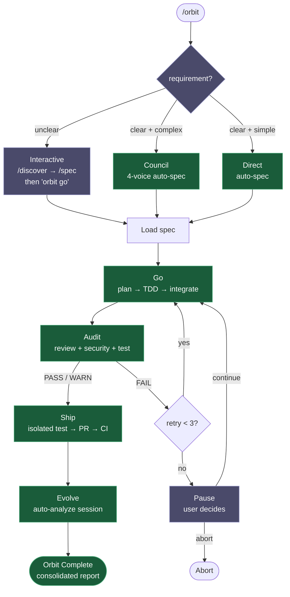
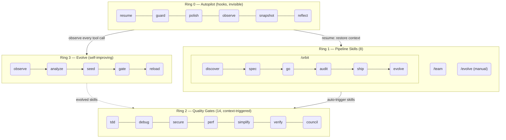

<h1 align="center">Epic Harness</h1>

<blockquote><p align="center">A multi-tool AI agent harness that learns from every session — 22 skills, autonomous pipelines, and a self-evolving engine.</p></blockquote>

<p align="center"><b>One harness, six AI tools. Autonomous from spec to PR. Smarter every session.</b></p>

<p align="center">
<a href="README.md">English</a> | <a href="i18n/ja/README.md">日本語</a> | <a href="i18n/ko/README.md">한국어</a> | <a href="i18n/de/README.md">Deutsch</a> | <a href="i18n/fr/README.md">Français</a> | <a href="i18n/zh-CN/README.md">简体中文</a> | <a href="i18n/zh-TW/README.md">繁體中文</a> | <a href="i18n/pt-BR/README.md">Português</a> | <a href="i18n/es/README.md">Español</a> | <a href="i18n/hi/README.md">हिन्दी</a>
</p>

<p align="center">
  <a href="https://github.com/epicsagas/epic-harness/stargazers"></a>
  <a href="https://github.com/epicsagas/epic-harness/network/members"></a>
  <a href="https://github.com/epicsagas/epic-harness/issues"></a>
  <a href="https://github.com/epicsagas/epic-harness/commits/main"></a>
</p>
<p align="center">
  <a href="LICENSE"></a>
  <a href="https://github.com/epicsagas/epic-harness/releases"></a>
  <a href="https://blog.rust-lang.org/"></a>
  <a href="https://github.com/epicsagas/epic-harness#supported-tools"></a>
  <a href="https://buymeacoffee.com/epicsaga"></a>
</p>

A multi-tool AI agent harness with **22 skills (8 pipeline + 14 quality gates)**, a **self-evolving engine**, **unified memory**, and a **single-command autonomous pipeline** (`/orbit`). Works with Claude Code, Codex, Cursor, OpenCode, and Cline — all sharing the same `~/.harness/` data directory. After each session, the evolve loop analyzes failures, generates targeted skills, and loads them next time.

<p align="center">
  
</p>

---


### Web Dashboard — auto-launches on session start

10-screen real-time metrics for eval scores, tool stats, orbit pipelines, evolved skills, and hook health. Opens automatically with the first Claude Code session — no manual setup needed.

<p align="center">
  
  
</p>

```bash
# Auto-launches on first session (default: http://localhost:7700)
# Configure port or disable in ~/.harness/config.toml:
[dashboard]
port = 7700       # set to 0 to disable auto-launch
auto_open = true  # open browser on first session
```

Screens: **Dashboard** · /orbit Pipeline · Skills (22) · Live Agents · Eval & Evolve · Hooks (6) · Integrations (6) · harness-mem · Settings

---

## What It Does

One command ships a feature end-to-end. Skills fire without you asking. The agent gets smarter after every session.

```bash
$ /orbit "Add JWT auth to the login API"
→ spec approved → go (TDD subagents) → audit (PASS) → ship (PR + CI) → evolve
```

Or invoke pipeline skills directly:

```bash
/spec "Add JWT auth to the login API"   # clarifies requirements → SPEC-*.md
/go                                      # auto-plans → TDD subagents → 4 min
/audit                                   # parallel review + security + tests → PASS
/ship                                    # isolated test → PR → CI green
```

Skills trigger automatically in the background — no extra commands:

```
Writing a feature?    → tdd fires (Red→Green→Refactor enforced)
Test fails?           → debug fires (root-cause first, no random fixes)
Touching auth or DB?  → secure fires (OWASP checklist, no shortcuts)
File hits 200 lines?  → simplify fires (extract, rename, reduce)
```

After the session ends, the **evolve loop** analyzes what broke, generates targeted skills, and loads them next session. The agent that struggled with TypeScript build failures will have an `evo-ts-care` skill next time.

---

## Installation

> **First time?** Read the [Quick Start Guide (5 min)](docs/quickstart.md). For data storage details, see the [Data Map](docs/data-map.md).

### Claude Code

```
/plugin marketplace add epicsagas/plugins
/plugin install epic@epicsagas
```

Auto-installs the binary and registers all hooks in one step.

### Codex CLI

```bash
codex plugin marketplace add epicsagas/plugins
```

Auto-installs all 22 skills and registers hooks. Available immediately — no further steps needed.

Updates with `codex plugin update epic@epicsagas`.

### macOS / Linux

```bash
brew install epicsagas/tap/epic-harness
```

No Homebrew? Use the installer script:

```bash
curl --proto '=https' --tlsv1.2 -LsSf \
  https://github.com/epicsagas/epic-harness/releases/latest/download/install.sh | sh
```

### Windows

```powershell
irm https://github.com/epicsagas/epic-harness/releases/latest/download/install.ps1 | iex
```

### Via Rust toolchain

```bash
cargo binstall epic-harness   # pre-built binary (fast)
cargo install epic-harness    # build from source
```

Then run the setup wizard:

```bash
epic install cursor         # Cursor IDE
```

> `epic-harness --version` to verify. Update with `brew upgrade epic-harness` or re-run the installer script.

Prerequisites: **Git**. Source/binary installs also need the [Rust toolchain](https://rustup.rs).

### `epic install` — setup wizard

After installing the binary, run `epic install` (or `epic install claude`) to:

1. Create `~/.harness/` directory structure
2. Sync commands and skills to the tool's config directory
3. Register the memory CLI for Claude Code
4. Create `~/.harness/config.toml` with defaults if absent

On Claude Code, `hooks/install.js` auto-runs on session start and installs the binary if missing. No manual step needed after the initial clone.

### Other tools

```bash
epic install cursor         # Cursor         → ~/.cursor/ (requires Cursor 1.7+)
epic install opencode     # OpenCode    → ~/.config/opencode/
epic install cline        # Cline       → ~/Documents/Cline/Rules/
epic install aider        # Aider       → ~/.aider.conf.yml + ~/.aider/
epic install              # Interactive menu
```

Integration files are **synced** from the binary: missing or outdated files are written. `AGENTS.md` is only created when absent.

### Verify

```bash
epic --version              # Binary installed
ls ~/.harness/              # Data directory exists
```

Inside a Claude Code session: `/evolve status`

---

## Pipeline Skills (Ring 1)

8 skills that orchestrate multi-step workflows. Invoke with `/skill-name` or let `/orbit` chain them.

| Skill | What it does |
|-------|-------------|
| `/orbit` | **Full autonomous pipeline**: spec → go → audit → ship → evolve in one shot |
| `/discover` | Problem discovery — 5 Whys, JTBD, Socratic questioning |
| `/spec` | Define requirements — converts to numbered R + AC document |
| `/go` | Build phase — auto-plan → TDD sub-agents → parallel execution → AC verification |
| `/audit` | Audit phase — parallel code review + security audit + tests |
| `/ship` | Shipping phase — isolated test → PR with full audit report → CI watch |
| `/evolve` | Manual evolution trigger — analyze sessions, view dashboard, rollback |
| `/team` | Browse org libraries, hire existing teams, or design new ones |

---

## /orbit — Autonomous Pipeline

`/orbit` wraps the entire pipeline into a single autonomous execution. Pick a mode — everything else is hands-off until the PR.



**Purple** — human steps: mode selection (unclear → interactive), 3× audit failure pause.
**Green** — clear + complex → council auto-spec; clear + simple → direct build; both fully autonomous.

State persisted in `$HARNESS_DIR/orbit/PIPELINE-{timestamp}.json` — survives context compaction.

> **Caveats**: The agent may bypass the pipeline when modifying orbit itself or editing docs only. See [Known Issues (Agent Judgment)](#known-issues-agent-judgment).

---

## Quality Gates (Ring 2)

14 skills that auto-trigger based on context. You don't invoke them.

| Skill | Triggers when |
|-------|--------------|
| **tdd** | New feature implementation or bug fix |
| **debug** | Test failure or runtime error |
| **secure** | Auth / DB / API / secrets code touched |
| **perf** | Loops, queries, rendering, batch operations |
| **simplify** | File > 200 lines or high cyclomatic complexity |
| **document** | Public API added or signature changed |
| **verify** | Before completing `/go` or `/ship` |
| **context** | Context window > 70% |
| **council** | Ambiguous architectural or design decisions |
| **orchestrate** | Multi-agent orchestration status and live agent intervention |
| **agent-introspection** | 3+ consecutive failures or circular retry pattern |
| **reflect** | On-demand `/reflect`: evidence-based human self-assessment — "Am I using AI as a thought amplifier?" Scores 5 dimensions from hook-collected data |
| **commit** | Conventional Commits generation — auto-generates from git diff |

> **Token budget note:** Claude Code loads skill descriptions into every session context. epic's 22 skills fit within the default `skillListingBudgetFraction: 0.01` (1%). If you install additional skills (e.g. episteme, alcove, obscura), the combined total may exceed the budget and trigger a "descriptions dropped" warning. Add this to `~/.claude/settings.json` to fix it:
>
> ```json
> "skillListingBudgetFraction": 0.02
> ```
>
> Use `0.03` if you have 20+ skills installed.

---

## Evolve (Ring 3)

The harness watches every tool call, scores it on 3 axes, detects failure patterns, and generates targeted skills — automatically, at session end.

### Scoring

```
composite = 0.5 × tool_success + 0.3 × output_quality + 0.2 × execution_cost
```

Failure classification (9 types): `type_error` · `syntax_error` · `test_fail` · `lint_fail` · `build_fail` · `permission_denied` · `timeout` · `not_found` · `runtime_error`

### Pattern Detection

| Pattern | Detects | Default threshold |
|---------|---------|-------------------|
| `repeated_same_error` | Same error N+ times | 3 |
| `fix_then_break` | Edit success → build/test fails | 3 lookback, 2 cycles |
| `long_debug_loop` | Stuck on same file | 5 operations |
| `thrashing` | Edit↔Error alternating | 3 edits, 3 errors |

### Evolution Flow

```
Observe (PostToolUse — 3-axis scoring)
    ↓ obs/session_{id}.jsonl
Analyze (SessionEnd)
    ↓ per-tool, per-ext scores + patterns
Propose (Solver — graduated by score: ≥0.90 skip, ≥0.70 moderate, <0.70 full)
    ↓ SkillProposal[] with confidence
Curate (Accept/Merge/Skip, feedback masked from solver)
    ↓ evolved/{skill}/SKILL.md + meta.json
Gate (format check, dedup, cap 10, gated promotion ≥ 3 sessions)
    ↓ evolved_backup/ (best checkpoint)
Instinct (high-success patterns → cross-project memory.db nodes)
    ↓
Reload (next session — resume loads evolved skills)
```

Skill seeding: weak tool (success <60%, min 5 obs), weak file type (success <50%, min 3 obs), high-frequency error (5+ occurrences).

Stagnation: 3 sessions without 5% improvement → auto-rollback to best checkpoint.

### Skill Effectiveness

Every evolved skill tracked with A/B attribution:

```
/evolve history → Skill Effectiveness

| Skill              | With | Without | Delta |
|--------------------|------|---------|-------|
| evo-ts-care        | 0.87 | 0.72    | +15%  |
| evo-bash-discipline| 0.65 | 0.68    | -3%   |
```

Positive delta = effective. Negative = consider removing via `/evolve rollback`.

### Cold-Start Presets

On first session, stack-appropriate preset skills auto-apply:

| Stack | Presets |
|-------|---------|
| Node.js/TypeScript | `evo-ts-care`, `evo-fix-build-fail` |
| Go | `evo-go-care` |
| Python | `evo-py-care` |
| Rust | `evo-rs-care` |

### Instinct Learning

High-success patterns extracted and promoted across projects:

```
observe (100% confirmed) → extract_instincts() → instinct node (confidence ≥ 0.8)
    → promote to global when observed in ≥ 2 projects
```

```bash
/evolve              # Run now
/evolve status       # Dashboard: scores, trends, patterns, skills
/evolve history      # Full history + skill effectiveness
/evolve cross-project # Cross-project pattern analysis
/evolve rollback     # Restore previous best
/evolve reset        # Clear all evolution data
```

---

## Hooks (Ring 0)

Run invisibly on every session. Single Rust binary (`epic-harness`) with subcommands.

| Hook | When | Does |
|------|------|------|
| **resume** | Session start | Restore context, load memory, detect stack |
| **guard** | Before Bash | Block force-push-to-main, `rm -rf /`, DROP prod |
| **polish** | After Edit | Auto-format (Biome/Prettier/ruff/gofmt) + typecheck |
| **observe** | Every tool use | Log to `~/.harness/projects/{slug}/obs/` for evolution |
| **snapshot** | Before compact | Save state to `~/.harness/projects/{slug}/sessions/` |
| **reflect** | Session end | Auto-evolution engine: analyze failures, seed evolved skills, update metrics, ingest to memory. Feeds `/reflect` skill with data |

Polish feeds back into observe: format failure → `lint_fail`, TypeScript error → `build_fail`. Edit→Error thrashing gets detected even when errors come from polish.

Each session writes its own `session_{date}_{pid}_{random}.jsonl` — multiple concurrent sessions won't corrupt each other's data.

### Hook Profiles

Via `~/.harness/config.toml` or `EPIC_HOOK_PROFILE` env var:

| Profile | Active hooks |
|---------|-------------|
| `minimal` | guard, observe, resume |
| `standard` (default) | above + polish, reflect, snapshot |
| `strict` | all hooks + future strict-only checks |

### Custom Guard Rules

Add project-specific rules via `.harness/guard-rules.yaml` in your project root:

```yaml
blocked:
  - pattern: kubectl\s+delete\s+namespace | msg: Namespace deletion blocked
warned:
  - pattern: docker\s+system\s+prune | msg: Docker prune — verify first
```

---

## Team (`epic team`)

Teams are **org-level**, not project-bound. Running `/team` in any project enriches a shared pool of agent definitions — never silently overwrites.

```bash
epic team                              # Interactive: scan → design → write → sync
epic team sync backend                 # Dispatch agents → .claude/agents/backend/
epic team link backend                 # Dispatch + register project in team config
epic team list                         # All teams in current org
epic team list --org netflix           # Teams in a named org
epic team show backend --playbook      # Config + full playbook
epic team delete backend               # Recall from current project only
epic team delete backend --global      # Permanently delete from org store
```

After syncing, agents are available in the next session: `@domain-expert`, `@reviewer`, `@tester`, etc.

| Type | Keyword | Default agents |
|------|---------|---------------|
| Stream-aligned | `stream` | domain-expert, reviewer, tester |
| Platform | `platform` | api-designer, infra-specialist, dx-agent |
| Enabling | `enabling` | specialist |
| Complicated Subsystem | `subsystem` | domain-specialist, integration-tester |

Multi-org: `epic team --org netflix` — separate topology per org.

Merge strategy: changed agents prompt (default: keep existing, backup to `.history/`). Playbook always appends.

---

## Multi-Tool Support

All tools share the same `~/.harness/projects/{slug}/` data directory.

| Tool | Ring 0 Hooks | Skills | Agents |
|------|-------------|--------|--------|
| **Claude Code** | ✓ Full | ✓ 22 (pipeline + quality) | Live |
| **Codex CLI** | ✓ Full¹ | ✓ 22 | — |
| **Cursor** | ✓ Full³ | ✓ via rules | Live |
| **OpenCode** | ✓ Partial⁴ | — | — |
| **Cline** | ✓ Full⁵ | — | — |
| **Aider** | —⁶ | — | — |

¹ Plugin marketplace · ³ Cursor 1.7+ · ⁴ JS plugin · ⁵ 5 hook scripts · ⁶ Conventions only

---

## Architecture: 4-Ring Model



---

## Cross-Project Learning

Opt-in to share failure patterns across projects:

```bash
touch ~/.harness/projects/{slug}/.cross-project-enabled
```

Session end → exports anonymized patterns to `~/.harness/global_patterns.jsonl`. Session start → shows hints from other projects' weak areas.

---

## Unified Memory

All agents share a knowledge graph in `~/.harness/memory.db` (SQLite with full-text search). No external runtime.

```
score = recency(25%) + importance(35%) + access_frequency(15%) + FTS_match(25%)
```

### CLI

```bash
epic mem recall "auth refactor" --project my-project   # Smart recall
epic mem add --title "JWT rotation" --type decision    # Add node
epic mem search "JWT"                                  # FTS5 search
epic mem list --type decision --project my-project    # Filter
epic mem context --project my-project                  # Project context
epic mem serve                                         # Web UI → :7700 or custom port with --port 8800
epic mem mcp-install                                   # Register memory access
epic mem export --out ./docs/memory                    # Export to Markdown
```

### CLI Commands (6)

| Command | Purpose |
|---------|---------|
| `epic-harness mem recall "HINT"` | Smart contextual recall with hint + project + graph neighbors |
| `epic-harness mem add --title "T" --type TYPE --body "B"` | Add node with auto-importance by type (or explicit 0.0–1.0) |
| `epic-harness mem search "QUERY"` | Keyword search (full-text), ranked by importance |
| `epic-harness mem list` | Filter by tag/type/project |
| `epic-harness mem context` | Project-scoped smart recall (no hint) |
| `epic-harness mem related ID` | Graph traversal from a node ID (finds connected knowledge) |

### Node Types

| Type | Created by | Importance |
|------|-----------|------------|
| `decision` | Manual / CLI | 0.9 |
| `resolution` | Manual / CLI | 0.8 |
| `concept` | Manual / CLI | 0.7 |
| `project` | Manual / CLI | 0.7 |
| `instinct` | Auto (reflect) | 0.7 |
| `pattern` | Auto (reflect) | 0.5 |
| `error` | Auto (reflect) | 0.4 |
| `session` | Auto (reflect) | 0.2 |

Lifecycle: 30+ days without access → 10% importance decay (floor 0.05). 180+ days → tagged `stale`, excluded from recall. `pinned` tag prevents decay.

> **WIP**: harness-mem is under active development. CLI, Web UI, and auto-recording pipeline are not yet fully functional. Do not rely on this feature in production.

---

<details>
<summary><strong>Project Data — directory layout</strong></summary>

## Project Data

All data lives in `~/.harness/` (home directory), not in your project root. Survives project deletion, doesn't pollute git history.

```
~/.harness/
├── memory.db                  # SQLite knowledge graph (nodes + edges + FTS5)
├── graph.json                 # Cached graph (for web UI)
├── config.toml                # User configuration
├── global_patterns.jsonl      # Cross-project patterns (opt-in)
├── orgs/                      # Team global store
│   └── {org}/teams/{team}/
│       ├── config.json, mission.md, playbook.md, agents/, .history/
└── projects/{slug}/
    ├── harness.db             # SQLite operational store (obs, sessions, metrics, evolution, orbit, evolved skills)
    ├── memory/                # Project patterns and rules
    ├── sessions/              # Session snapshots (for resume)
    ├── obs/                   # Tool usage observation logs (JSONL, legacy)
    ├── evolved/               # Auto-evolved skills
    │   ├── manifest.json
    │   └── {skill}/SKILL.md + meta.json
    ├── evolved_backup/        # Best checkpoint (for rollback)
    ├── dispatch/              # Skill dispatch logs
    ├── evolution.jsonl        # Full evolution history (legacy)
    └── metrics.json           # Aggregate stats + skill attribution (legacy)
```

### Migration (JSONL → SQLite)

Since v0.4.9, operational data is stored in `harness.db` (SQLite). Existing users with JSONL/JSON files should run once after upgrading:

```bash
epic-harness migrate --dry-run   # preview what would be imported
epic-harness migrate             # perform the import
```

Original files are **not deleted** after import. New users are automatically on SQLite — no action needed.

Share safety rules with your team: `.harness/guard-rules.yaml` in the project root (committed to git).

</details>

---

<details>
<summary><strong>Configuration — config.toml reference</strong></summary>

## Configuration

All tunable parameters in `~/.harness/config.toml`. Absent = hardcoded defaults.

```toml
# Priority: env var (EPIC_HOOK_PROFILE) > this file > defaults

[hook]
profile = "standard"         # "minimal" | "standard" | "strict"
gateguard_hints = true

[scoring]
weights = [0.5, 0.3, 0.2]   # [success, quality, cost]

[evolution]
max_skills = 10
stagnation_limit = 3
improvement_threshold = 0.05
gated_promotion_min = 3

[pattern]
# repeated_error_min = 3
# debug_loop_min = 5
# graduated_scope_skip = 0.90
# graduated_scope_moderate = 0.70

[instinct]
# confidence_threshold = 0.8
# promotion_min_projects = 2
# max_instincts = 20
# min_observations = 10
# min_avg_score = 0.5
```

</details>

---

## Known Issues (Agent Judgment)

These issues arise from the agent's interpretation of context rather than bugs in the code. Listed here so users know what to watch for.

### Discovered Issues

| Issue | When | What happens | Workaround |
|-------|------|-------------|------------|
| **Orbit self-modification bypass** | `/orbit` is asked to improve orbit itself | Agent may skip the orbit pipeline entirely and edit files ad-hoc on main, leaving changes uncommitted with no spec/PR/traceability | After orbit completes, check `git status`. If changes are on main without a pipeline state, commit manually or re-run `/orbit` from a separate branch |
| **Doc-only task skips protocol** | `/orbit` receives a markdown-only change (no code to test) | Agent may judge TDD/test phases as meaningless and skip the full pipeline | Acceptable for pure doc changes. For mixed code+doc, ensure the agent doesn't skip code-related phases |
| **Mode misclassification** | Request is borderline between Direct and Council | Agent may choose Direct when Council (4-voice) would catch more edge cases, or Council when Direct suffices | If the agent picks a mode that feels wrong, say "use Council mode" or "use Direct mode" explicitly |

### Intentional Design Choices

These were considered for enhancement but kept as-is after evaluation:

| Choice | Why not enhanced | Rationale |
|--------|-----------------|-----------|
| **Worktree enters at Go phase, not orbit start** | Could isolate from preflight | Preflight/mode/spec are read-only. Isolating earlier adds complexity with no benefit — the branch isn't created until Go phase anyway |
| **Worktree preserved after Ship** | Could auto-remove on PR merge | The branch is the PR head. Removing it before merge breaks the PR. Cleanup is left to the user after merge |
| **Branch named `orbit-{slug}` not `feature/{slug}`** | Could match conventional branch naming | `EnterWorktree` doesn't allow `/` in names. Renaming post-creation adds a step for cosmetic benefit only |
| **No lightweight pipeline path for doc changes** | Could detect doc-only and skip TDD/tests | Detection is fragile (what counts as "doc"?). Adding a separate path increases protocol complexity for marginal gain |

---

## Troubleshooting

<details>
<summary>command not found: epic after install</summary>

Add the Cargo bin directory to your PATH:

```bash
export PATH="$HOME/.cargo/bin:$PATH"
```

Add this line to your `~/.zshrc` or `~/.bashrc` to make it permanent.
</details>

<details>
<summary>Hooks not firing in Claude Code</summary>

Re-run the install to sync hooks into Claude Code settings:

```bash
epic install claude
```

Then restart Claude Code. Hooks are written to `~/.claude/settings.json`.
</details>

<details>
<summary>Permission denied on macOS (Gatekeeper)</summary>

macOS may block unsigned binaries downloaded from the internet:

```bash
xattr -d com.apple.quarantine ~/.cargo/bin/epic-harness
xattr -d com.apple.quarantine ~/.cargo/bin/epic
```
</details>

<details>
<summary>epic: binary not found inside plugin hooks</summary>

The plugin looks for the binary in `hooks/bin/epic-harness` first. After updating via `cargo install`, copy it:

```bash
cp ~/.cargo/bin/epic-harness hooks/bin/epic-harness
```
</details>

---

## Development

```bash
cargo install --path .                                        # Build + install
cp ~/.cargo/bin/epic-harness hooks/bin/epic-harness           # Update plugin binary
cargo test                                                    # Tests
```

Hooks look for the binary in two places: `hooks/bin/epic-harness` (plugin local) → `~/.cargo/bin/epic-harness` (PATH).

---

## Links

- [Changelog](CHANGELOG.md) — release history
- [Contributing](CONTRIBUTING.md) — how to contribute
- [Security](SECURITY.md) — reporting vulnerabilities
- [Issues](https://github.com/epicsagas/epic-harness/issues) — bug reports and feature requests

## Acknowledgments

- [a-evolve](https://github.com/A-EVO-Lab/a-evolve) — Automated evolution and benchmark patterns
- [agent-skills](https://github.com/addyosmani/agent-skills) — Claude Code agent skill system
- [everything-claude-code](https://github.com/affaan-m/everything-claude-code) — Comprehensive Claude Code patterns
- [gstack](https://github.com/garrytan/gstack) — Plugin architecture reference
- [harness](https://github.com/revfactory/harness) — Hook and harness infrastructure patterns
- [serena](https://github.com/oraios/serena) — Autonomous agent design
- [SuperClaude Framework](https://github.com/SuperClaude-Org/SuperClaude_Framework) — Multi-command framework architecture
- [superpowers](https://github.com/obra/superpowers) — Claude Code extension patterns

## License

[Apache 2.0](LICENSE)
